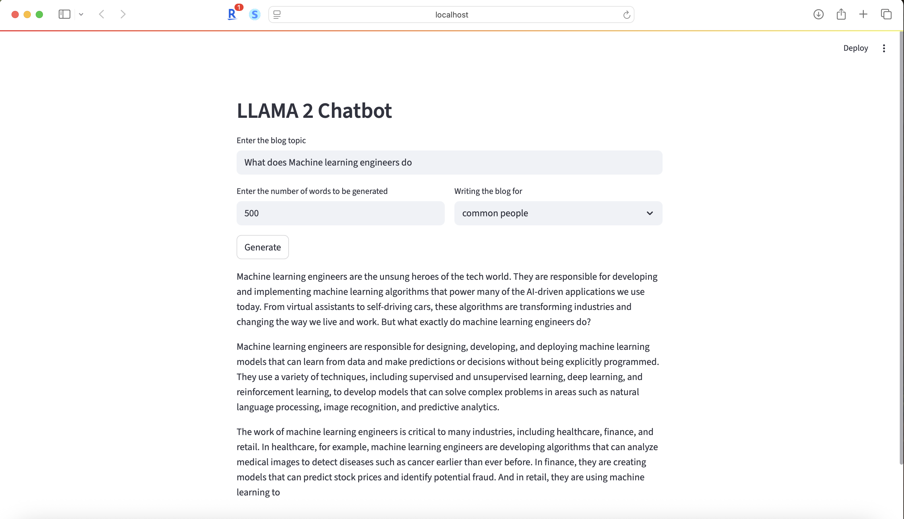

# LLAMA Environment Setup

## About the Model

This project uses the **Llama 2-7B** model, a large language model developed by Meta AI. Llama 2-7B is designed for a variety of natural language processing tasks and is known for its strong performance and open availability for research and commercial use.  
You can learn more about Llama 2 models on [Meta’s official page](https://ai.meta.com/resources/models-and-libraries/llama-downloads/).

## 1. Download the Model

You need to download the Llama 2-7B model weights from Hugging Face.  
- Visit: [https://huggingface.co/TheBloke/Llama-2-7B-Chat-GGML](https://huggingface.co/TheBloke/Llama-2-7B-Chat-GGML)
- Download the file: `llama-2-7b-chat.ggmlv3.q8_0.bin`
- Place the downloaded file in the `Model` directory of this project.

## 2. Activate the Conda Environment

```bash
conda activate /Users/godipally.shivakumar/Desktop/LLAMA/llama
```

## 3. Install Requirements

```bash
pip install -r /Users/godipally.shivakumar/Desktop/LLAMA/Model/requirements.txt
pip install langchain_community
```

## 4. Run the Streamlit App

```bash
streamlit run /Users/godipally.shivakumar/Desktop/LLAMA/app.py
```

## Example Output


